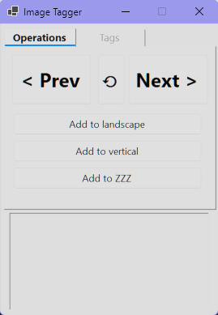
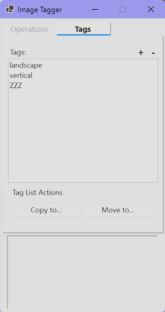
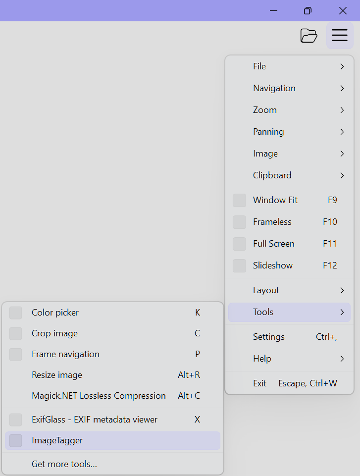

# ImageTagger

[中文](doc/README_CN.md)

 

## Project Overview
ImageTagger is a Windows Forms-based image tagging tool designed to work alongside the ImageGlass image viewer. It allows users to quickly categorize images into custom tag groups while browsing and supports batch operations such as copying or moving tagged images. The tool integrates deeply with ImageGlass via the ImageGlass Tools SDK, enabling real-time image path synchronization and navigation control.

## Installation Guide

### Prerequisites
1.  Windows OS (with .NET support).
2.  [ImageGlass](https://imageglass.org/) image viewer installed.

### Steps
1.  Download the latest release archive of ImageTagger.
2.  Extract the archive to any directory.
3.  Make ImageTagger as an external tool in ImageGlass for quick access.

## Usage

### Launching the Application

In ImageGlass, open the **Settings** menu and navigate to **Tools** > **ImageTagger** to launch the plugin. It automatically synchronizes with the currently viewed image.

### Tag Management
*   **Add Tag**: In the "Tags" tab, click the "+" button in the top right, enter a tag name, and confirm.
*   **Delete Tag**: Select a tag from the list and click the "-" button, or right-click and select "Delete".
*   **Manage Tags**: Right-click the tag list to use "Clear" (remove all image paths from the tag) or "Duplicate" (copy the tag and its contents).

### Tagging Images
1.  Ensure ImageGlass is running and displaying an image.
2.  In the "Tagging" tab of ImageTagger, you will see the current image path if synchronized.
3.  A button is displayed for each created tag.
4.  Click a tag button to add the current image to that tag.
5.  After tagging, ImageGlass will automatically navigate to the next image (this action supports Undo).

### Batch Operations
Select a tag in the "Tags" tab to use the functional buttons at the bottom:
*   **Copy to...**: Copy all images under the selected tag to a specified folder.
*   **Move to...**: Move all images under the selected tag to a specified folder (clears the tag list upon success).
*   **Undo**: Revert the last tagging or navigation action.

## Configuration

### Data Storage
All tags and image paths are stored in `tags.json` within the application's running directory.
*   This is a standard JSON file that can be manually backed up or edited (ensure correct formatting).

### Window Behavior
*   The application stays "Always on Top" by default for convenience while browsing images in full screen.
*   The window height adjusts automatically based on the number of tags and log entries.

## API Reference
This application primarily uses the `ImageGlass.Tools` library for communication with ImageGlass.

## Contributing
Issues and Pull Requests are welcome to improve this project.

1.  Fork the repository.
2.  Create your feature branch (`git checkout -b feature/AmazingFeature`).
3.  Commit your changes (`git commit -m 'Add some AmazingFeature'`).
4.  Push to the branch (`git push origin feature/AmazingFeature`).
5.  Open a Pull Request.

## License
This project is licensed under the Apache License 2.0. See the [LICENSE](LICENSE) file for details.
